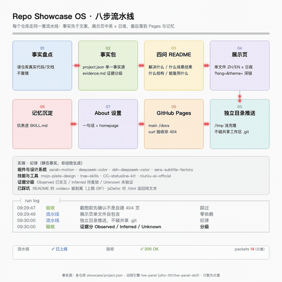
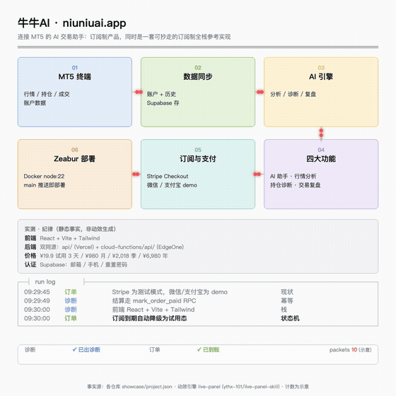
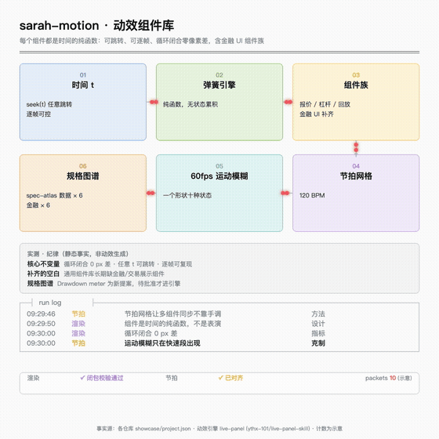
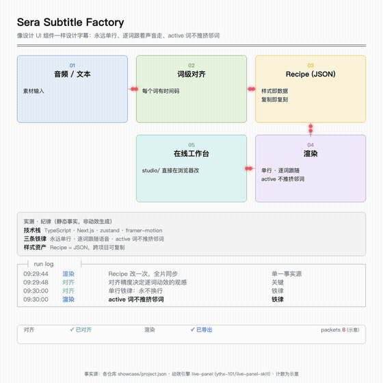
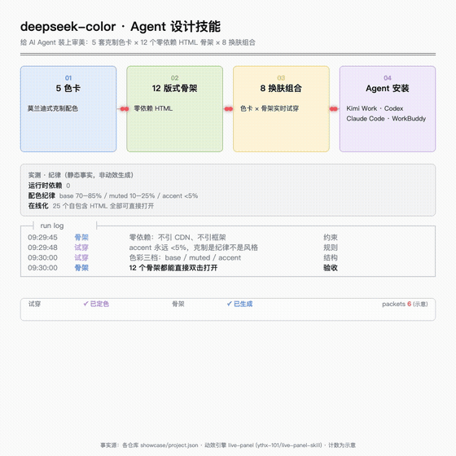
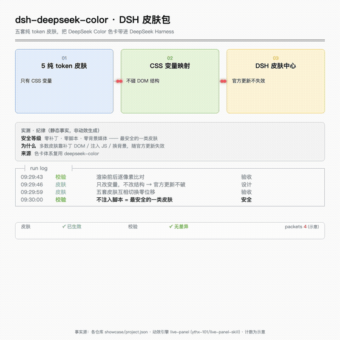
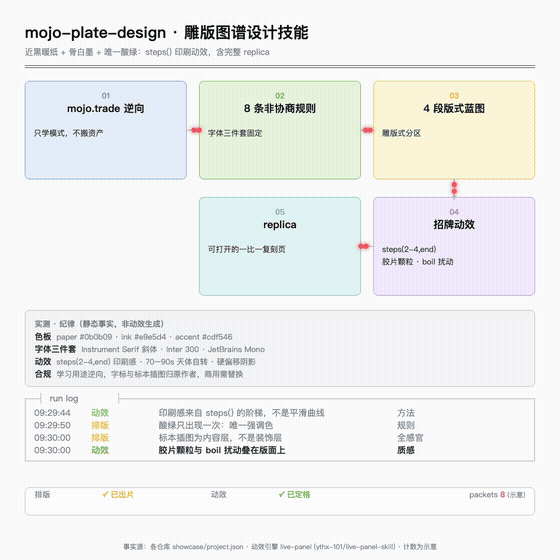
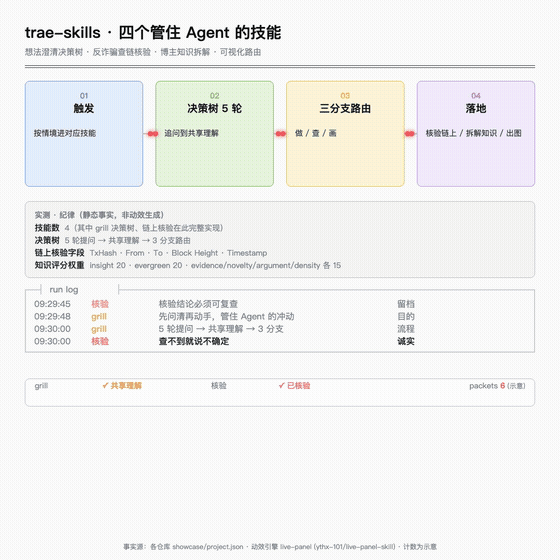

# Sera · 78tyih

**系统设计者。** AI × Trading × Media × Automation —— 把每个一次性任务升级为可复制的系统：任务 → 流程 → 组件 → Pipeline → Skill → Agent。

> 我的每个仓库都配一套**展示包**：四问 README（解决什么问题 / 什么场景什么结果 / 什么结构 / 能复用什么）+ 交互展示页（中英 × 日夜）。点开任何一行，30 秒看懂一个项目。

**↑ 每个项目还配一块「一直在跑」的架构面板**：版式不动，光点沿连线流动，日志滚动，阈值翻状态。→ [打开面板总目录](https://78tyih.github.io/78tyih/)

---

## 架构面板

> 一项工程读起来快，是因为能看见它在跑。每块面板的静态事实来自该仓库 `showcase/project.json`（单一事实源）；会动的计数只表示动效自身的状态，不代表真实吞吐——所以面板上标了「示意」。
> 引擎：[live-panel](https://github.com/ythx-101/live-panel-skill)（config JSON → 确定性的逐帧 mp4 / 网页）；生成器与配置留在 [`docs/panels/_tools/`](docs/panels/_tools/)，改一份 spec 即可重出全部面板。

| | |
|---|---|
|  **全景 · 八步流水线** |  **牛牛AI** |
|  **sarah-motion** |  **sera-subtitle-factory** |
|  **deepseek-color** |  **dsh-deepseek-color** |
|  **mojo-plate-design** |  **trae-skills** |

*为什么不是静态图？* 因为架构流程本质是「谁把什么交给谁」——静止的框线和在跑的连线，信息量差一截。这里用绝对坐标手工编排换来了像素级的美术控制，代价是改一个项目就要重排版面；愿意用自动布局换低成本时，[Archify](https://github.com/tt-a1i/archify)（语义化 JSON → 自动布线）是另一条路，两者不是同一品类。

---

## 在线产品

| 项目 | 一句话 | 入口 |
|---|---|---|
| **牛牛AI** | 连接 MT5 的 AI 交易助手：AI 助手 / 行情分析 / 持仓诊断 / 交易复盘，订阅制 | [niuniuai.app](https://niuniuai.app) · [仓库](https://github.com/78tyih/niuniu-ai-official) · [展示页](https://78tyih.github.io/niuniu-ai-official/showcase.html) |

## 组件与设计系统

| 项目 | 一句话 | 展示页 |
|---|---|---|
| **sarah-motion** | 纯时间函数弹簧引擎上的动效组件库：一个形状十种状态、光标驱动、120 BPM 节拍网格、60fps 运动模糊 | [showcase](https://78tyih.github.io/sarah-motion/showcase.html) · [规格图谱](https://78tyih.github.io/sarah-motion/spec-atlas.html) |
| **sera-subtitle-factory** | 像设计 UI 组件一样设计字幕：永远单行、逐词跟随语音、样式 = Recipe(JSON) | [showcase](https://78tyih.github.io/sera-subtitle-factory/showcase.html) · [在线工作台](https://78tyih.github.io/sera-subtitle-factory/studio/) |
| **deepseek-color** | 给 AI Agent 装上审美的设计技能：5 套克制色卡 × 12 个零依赖 HTML 骨架 | [showcase](https://78tyih.github.io/deepseek-color/showcase.html) · [试衣间](https://78tyih.github.io/deepseek-color/showcase.html#tryon) |
| **dsh-deepseek-color** | DeepSeek Harness 皮肤包：五色卡纯 token，适配皮肤中心 | [showcase](https://78tyih.github.io/dsh-deepseek-color/showcase.html) |
| **mojo-plate-design** | 「雕版图谱」设计技能：近黑暖纸 + 骨白墨 + 唯一酸绿，steps() 印刷动效，含完整 replica | [showcase](https://78tyih.github.io/mojo-plate-design/showcase.html) · [Replica](https://78tyih.github.io/mojo-plate-design/replica/index.html) |

## Agent 技能与工具

| 项目 | 一句话 | 展示页 |
|---|---|---|
| **trae-skills** | 四个管住 Agent 冲动的技能：想法澄清决策树、反诈骗查链、博主知识拆解、可视化路由 | [showcase](https://78tyih.github.io/trae-skills/showcase.html) · [决策树演示](https://78tyih.github.io/trae-skills/showcase.html#tree) |

---

<b>这些展示包是怎么做出来的？（一套可复用的工作流）</b>

每个仓库走同一套八步流水线：事实盘点 → 事实包（`project.json` 单一事实源 + 证据分级 Observed/Inferred/Unknown）→ 四问 README → 交互展示页（单文件，中英 × 日夜，`?lang=&theme=` 深链）→ 独立目录推送 → GitHub Pages（main /docs）→ curl 验收 → 记忆沉淀。

踩过的坑都记在案：README 的 `<video>` 会被 GitHub 剥离（上限是 GIF）、jsDelivr 对 `.html` 返回纯文本（页面必须走 Pages）、缩放 iframe 居中要先按缩放后尺寸定位。素材优先真实实拍：无头浏览器逐帧连拍 + 按内容边界裁剪，PSNR/SSIM 定压缩参数。

**架构面板层（2026-10-05 追加）**：展示包之后补一层「在跑的面板」——每个项目一份紧凑 spec → 生成器编译成 live-panel config（绝对坐标 + 状态机）→ 逐帧确定性渲染 mp4 → 抽 5 秒转 GIF 嵌进本页，整页面板托管 Pages。生成器 `docs/panels/_tools/gen_panels.py` 与 8 份 config 全部进库，改 spec 重跑即出全套。渲染前必跑 `check_frames.py`（抽样 124 个时间点，检测文字溢出/越界——它确实抓到过末行定位冲出画布）。

<b>风险与合规声明</b>

- 牛牛AI 页面遵循「无收益承诺、风险可见」原则；交易（尤其外汇/CFD）有高风险，可能损失全部本金，不构成投资建议。
- mojo-plate-design 为学习目的从 mojo.trade 逆向，字标与标本插图归原作者所有，商用前需替换。

