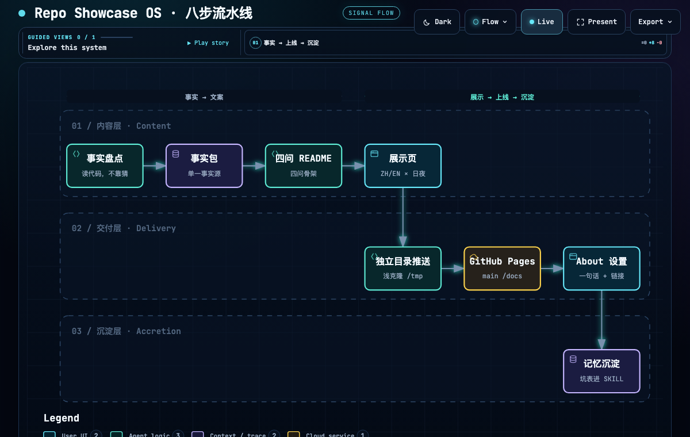
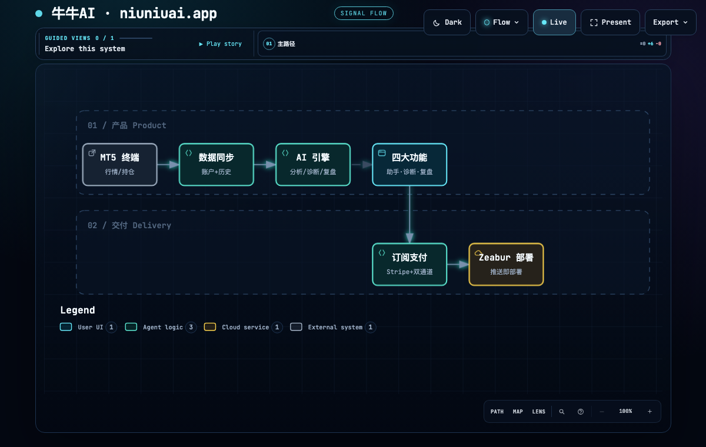
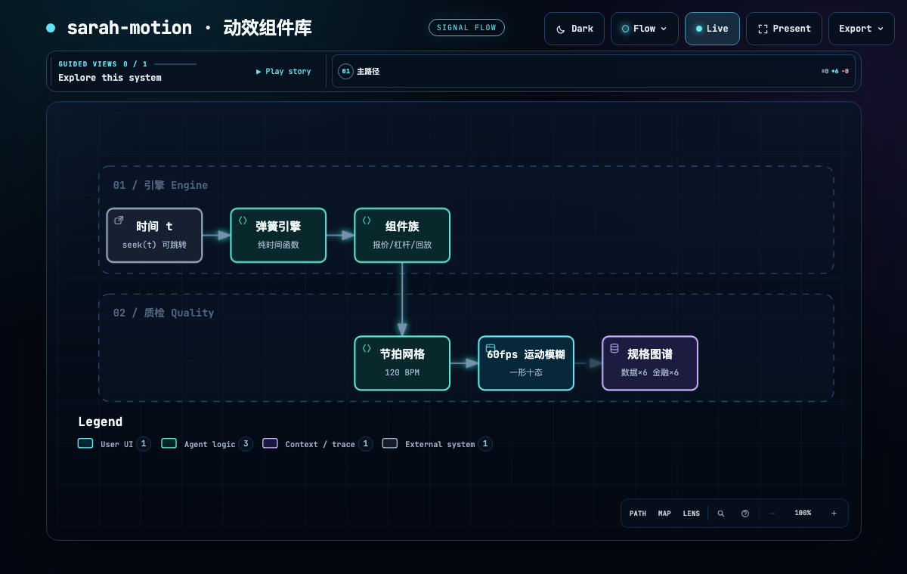
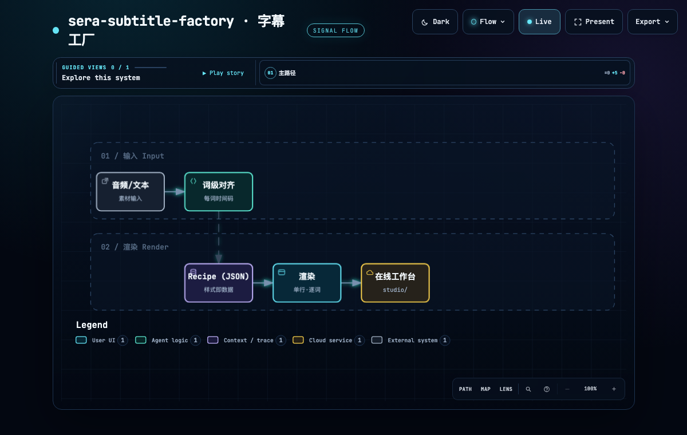
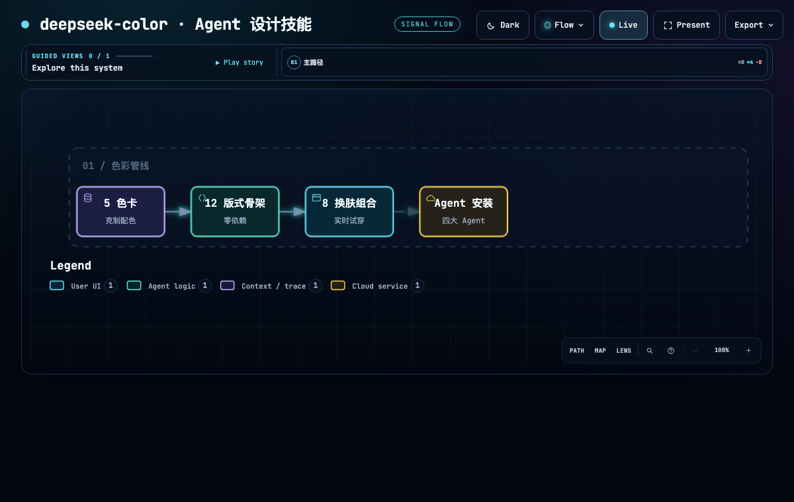
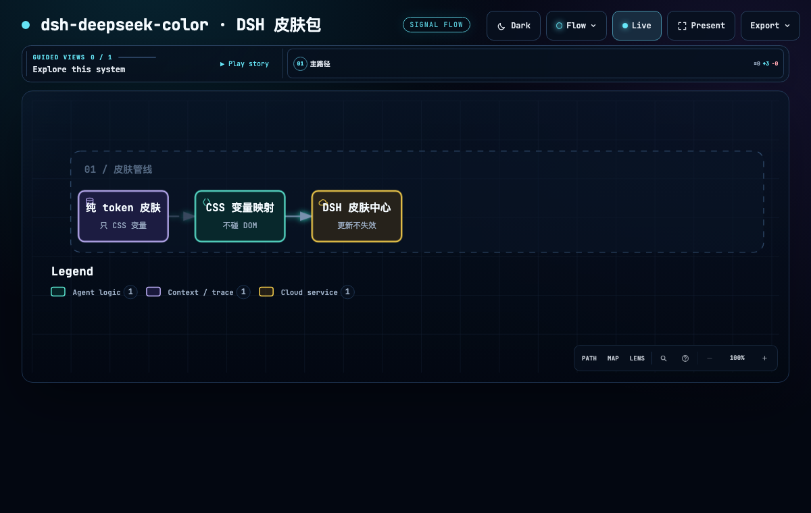
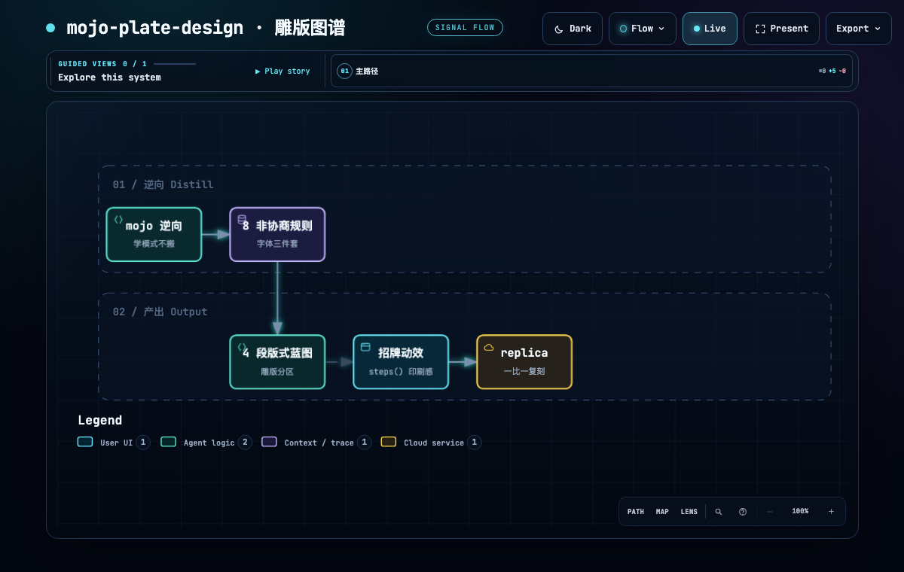
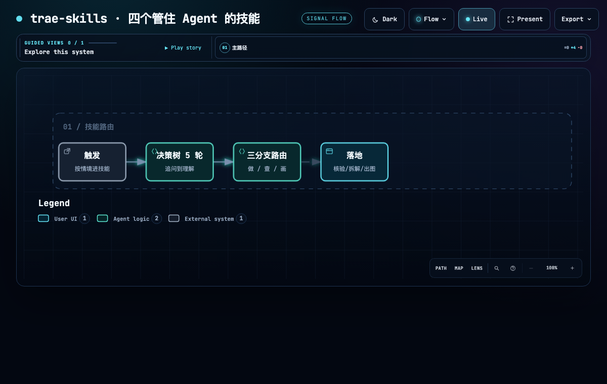

# Sera · 78tyih

**系统设计者。** AI × Trading × Media × Automation —— 把每个一次性任务升级为可复制的系统：任务 → 流程 → 组件 → Pipeline → Skill → Agent。

> 我的每个仓库都配一套**展示包**：四问 README（解决什么问题 / 什么场景什么结果 / 什么结构 / 能复用什么）+ 交互展示页（中英 × 日夜）。点开任何一行，30 秒看懂一个项目。

**↑ 每个项目一张架构图**：语义化 JSON → 自动布局，可 hover 探索、日夜主题。→ [架构图谱](#架构图谱) · [在线交互版](https://78tyih.github.io/78tyih/arch/overview.html)

---

## 架构图谱

> 每个项目一张架构流程（workflow），用 [Archify](https://github.com/tt-a1i/archify)（MIT）从语义化 JSON 生成：节点/泳道自动布局、可 hover 探索、日夜主题、`validate --quality showcase` 9 项验收。事实源仍是各仓库 `showcase/project.json`；候选 JSON 进库 [`docs/arch/*.workflow.json`](docs/arch/)。

| | |
|---|---|
|  **全景 · 八步流水线** |  **牛牛AI** |
|  **sarah-motion** |  **sera-subtitle-factory** |
|  **deepseek-color** |  **dsh-deepseek-color** |
|  **mojo-plate-design** |  **trae-skills** |

*为什么弃 live-panel 改 Archify？* live-panel 是绝对坐标手工编排（改一个节点要重排版面），Archify 是语义化自动布局（改节点自动重排、有 9 项验收、可 hover 探索）。对「读懂架构」这个目的，后者更直观、维护成本更低；「一直在跑」的动态海报形态若以后要，再单独出。

---

## 在线产品

| 项目 | 一句话 | 入口 |
|---|---|---|
| **牛牛AI** | 连接 MT5 的 AI 交易助手：AI 助手 / 行情分析 / 持仓诊断 / 交易复盘，订阅制 | [niuniuai.app](https://niuniuai.app) · [仓库](https://github.com/78tyih/niuniu-ai-official) · [展示页](https://78tyih.github.io/niuniu-ai-official/showcase.html) |

## 组件与设计系统

| 项目 | 一句话 | 展示页 |
|---|---|---|
| **sarah-motion** | 纯时间函数弹簧引擎上的动效组件库：一个形状十种状态、光标驱动、120 BPM 节拍网格、60fps 运动模糊 | [showcase](https://78tyih.github.io/sarah-motion/showcase.html) · [规格图谱](https://78tyih.github.io/sarah-motion/spec-atlas.html) |
| **sera-subtitle-factory** | 像设计 UI 组件一样设计字幕：永远单行、逐词跟随语音、样式 = Recipe(JSON) | [showcase](https://78tyih.github.io/sera-subtitle-factory/showcase.html) · [在线工作台](https://78tyih.github.io/sera-subtitle-factory/studio/) |
| **deepseek-color** | 给 AI Agent 装上审美的设计技能：5 套克制色卡 × 12 个零依赖 HTML 骨架 | [showcase](https://78tyih.github.io/deepseek-color/showcase.html) · [试衣间](https://78tyih.github.io/deepseek-color/showcase.html#tryon) |
| **dsh-deepseek-color** | DeepSeek Harness 皮肤包：五色卡纯 token，适配皮肤中心 | [showcase](https://78tyih.github.io/dsh-deepseek-color/showcase.html) |
| **mojo-plate-design** | 「雕版图谱」设计技能：近黑暖纸 + 骨白墨 + 唯一酸绿，steps() 印刷动效，含完整 replica | [showcase](https://78tyih.github.io/mojo-plate-design/showcase.html) · [Replica](https://78tyih.github.io/mojo-plate-design/replica/index.html) |

## Agent 技能与工具

| 项目 | 一句话 | 展示页 |
|---|---|---|
| **trae-skills** | 四个管住 Agent 冲动的技能：想法澄清决策树、反诈骗查链、博主知识拆解、可视化路由 | [showcase](https://78tyih.github.io/trae-skills/showcase.html) · [决策树演示](https://78tyih.github.io/trae-skills/showcase.html#tree) |

---

<b>这些展示包是怎么做出来的？（一套可复用的工作流）</b>

每个仓库走同一套八步流水线：事实盘点 → 事实包（`project.json` 单一事实源 + 证据分级 Observed/Inferred/Unknown）→ 四问 README → 交互展示页（单文件，中英 × 日夜，`?lang=&theme=` 深链）→ 独立目录推送 → GitHub Pages（main /docs）→ curl 验收 → 记忆沉淀。

踩过的坑都记在案：README 的 `<video>` 会被 GitHub 剥离（上限是 GIF）、jsDelivr 对 `.html` 返回纯文本（页面必须走 Pages）、缩放 iframe 居中要先按缩放后尺寸定位。素材优先真实实拍：无头浏览器逐帧连拍 + 按内容边界裁剪，PSNR/SSIM 定压缩参数。

**架构图谱层（2026-10-07 追加）**：展示包之后补一层「架构图」——每个项目一份紧凑 spec → 生成 Archify workflow JSON（schema v2）→ `validate --quality showcase` 9 项验收 → `deliver` 交互式 HTML → 托管 Pages。候选 JSON 与生成器进库 `docs/arch/`，改 spec 重跑即出全套。相比早期 live-panel（绝对坐标手工编排，改一个节点要重排版面，已弃用）：Archify 是语义自动布局，改节点自动重排、有 9 项语义验收、可 hover 探索，维护成本低得多。

<b>风险与合规声明</b>

- 牛牛AI 页面遵循「无收益承诺、风险可见」原则；交易（尤其外汇/CFD）有高风险，可能损失全部本金，不构成投资建议。
- mojo-plate-design 为学习目的从 mojo.trade 逆向，字标与标本插图归原作者所有，商用前需替换。

